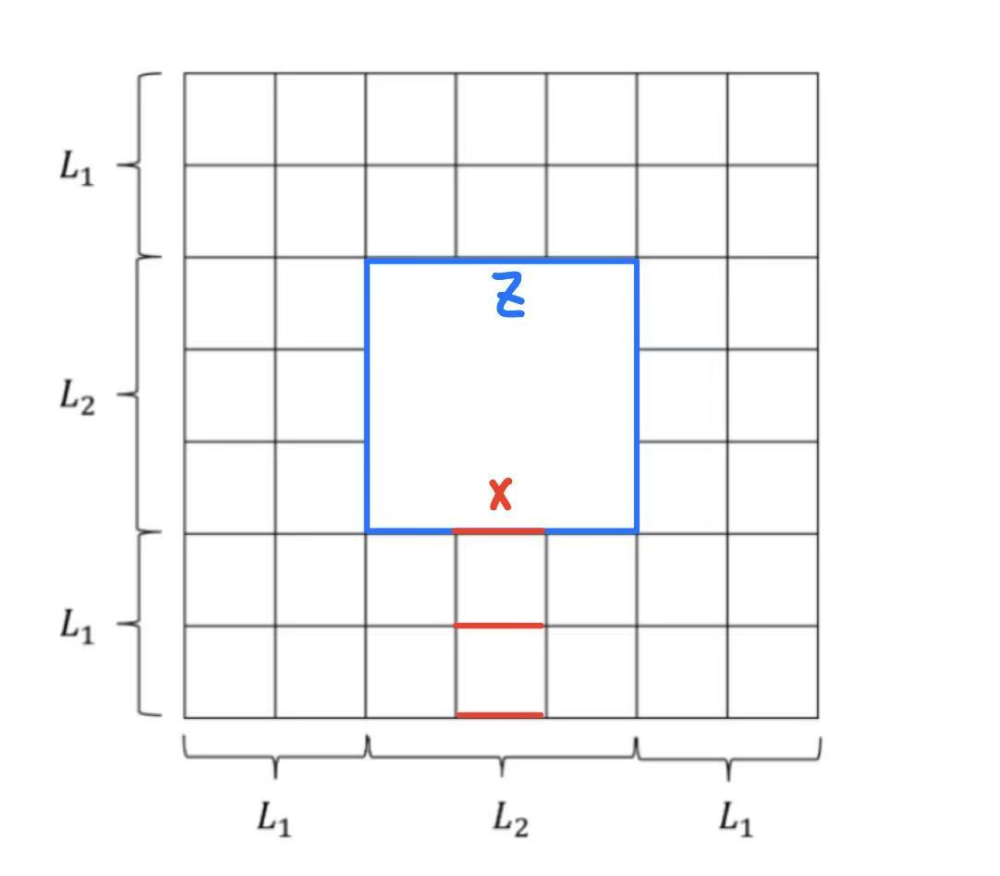

本文是Alexei Kitaev在2001年的论文《Topological quantum memory》的阅读笔记，其中补充了一些计算细节，但大部分都是翻译与概括原意。

原论文：[Topological quantum memory](https://arxiv.org/pdf/quant-ph/0110143v1)

---

## 0. abstract

研究的对象是**表面码(surface code)**。qubits被放在有**非平凡拓扑曲面**的二维晶格上，其编码操作对应于曲面上的同调非平凡环路。在本文中：
1. 我们建立了纠错流程，并评估其效率。
2. 建立了一个有序-无序相变模型，当单个qubits的错误率控制在阈值之下时，编码信息在大代码块极限下受到保护。这一相变模型可视为有淬火无序特性的三维 $\mathbb Z_2$ 晶格规范理论。
3. 在假设量子门局域、qubits可被快速测量且多项式时间的任务可在经典计算机上瞬间完成下，我们估计了精确的阈值。
4. 设计了一种在四维及以上的量子纠错流程，可以无需快速测量与快速经典运算的假设。
5. 最后，我们还讨论了纠错算法的具体实现。

## 1. Introduction

量子计算的一大问题在于量子态的**退相干**，但通过巧妙的编码，可以使复杂系统稳定可靠。量子容错中的**阈值定理**指出，只要基本量子门的错误率低于某一阈值，则任意长度量子计算都能保持任意高的精度。这个临界值 $p_c\gtrsim 10^{-4}$ 。粗糙的说，这意味着单个门操作的时间应当最多为退相干时间的 $10^{-4}$。但这一阈值的得出建立在可以对任意两个qubits进行门操作基础上的，与量子门的局域性相冲突，同时其建立在级联编码上。我们将采用建立在表面码上的估计方案，该估计适用于量子门**严格局域**的系统，要求所有的非局域操作由瞬间进行的经典计算机完成。具体来说，通过量子测量得到**syndrome**（我不知道怎么翻译），用经典计算机得到纠错方案，假设经典计算的耗时为qubits数的多项式函数。可以估算出阈值 $p_c\ge 1.7\times 10^{-4}$。以下是各章节大致内容：
- 第二章列出要实现容错量子计算的硬件特性
- 第三章回顾了表面码的特性，且探究了qubits测量中的错误会增加纠错的难度。
- 第四章将纠错机制与局域相互作用的二维随机Ising模型相联系，其相图已用Monte Carlo模拟得到。
- 第五章通过证明阈值的粗略下限得到，在适当条件下，大码块极限下纠错流程必能成功。通过数值模拟淬火规范理论能得到更精确的阈值。
- 第六章证明即使经典存储器容量受限于多项式规模，原先的精确阈值仍适用。
- 第七章分析具体量子线路，将阈值转化为对基本量子门的保真度要求。大约要求退相干时间为量子门并行操作时间的6000倍。
- 第八章证明了编码qubits可被精确制备并测量，同时阐述如何从小块尺寸制备大块尺寸表面码。其可制备未知量子态。
- 第九章详细说明如何对量子信息执行通用量子门，且保持容错机制的实现。
- 第十章摒弃“qubits可被快速测量，且经典计算能瞬间完成”的假设，设计了一种不对测量与经典计算要求的纠错方案，但其要求空间维数为四维及以上，否则量子门不具有局域性。
- 第十一章是一些总结性论述。

## 2. 容错与量子架构

此章对噪声的本质特性与计算机的运行机制预设一些假设。
- 常数错误率。设噪声强度与qubits数无关，即每个qubits发生错误的概率不变。
- 弱的错误关联。错误不得是强关联的（在时间与空间上都是）。当一个代码块上同时发生很多qubits错误，纠错就会失败。
- 并行运算。我们要能在一个时间步长上执行多个量子门操作。
- 可重复存储。纠错需要将熵转移到“废弃”的辅助qubits上，因此辅助qubits必须擦除及时。
在一些阈值估算中，还可能会用到下面的额外假设：
- 快速测量。假设qubits的测量可以与量子门一样迅速。这不一定正确，因为将其放大为宏观信号需要时间。
- 快速准确的经典处理。
- 无泄漏。错误即使发生，量子比特仍可访问，其不会从设备中“泄露”。若发生泄露，也能很快更新qubits以修复。
- 非局域量子门。当双qubits量子门可作用于任意qubits对，则系统可容忍更高错误率。
当我们坚持所有量子门都是局域的时，另一个理想特性为：
- 高配位数。高维下qubits近邻的qubits数更多。

## 3. 表面码

### Toric codes

考虑二维环面上的正方晶格，qubits与其边一一对应，这类编码称为**Toric codes**。其可简单推广至其他二维曲面上的情形，这些统称为表面码。其为**稳定子编码(stabilizer code)** 的其中一种。稳定子编码描述为一组相互对易的校验算子的共同本征空间，对应于本征值均为+1。每个校验算子都是**Pauli算符**，作用于 $n$ 个qubits上的Pauli算符为 $n$ 个Pauli矩阵的张量积，属于下面的空间：
$$
\{I,X,Y,Z\}^{\otimes n}
$$
对于 $L\times L$ 的正方晶格，qubits数为 $2L^2$。校验算子被定义在每个顶点与每个面上：
$$
X_s=\bigotimes_{s\in l}X_l,\quad Z_P=\bigotimes_{l\in P}Z_l
$$
即在顶点上的校验算子对共顶点的四条边作用 $X$ ，在面上的校验算子对面的四条边作用 $Z$。

> [!tip]
> 这样定义出的校验算子是相互对易的。因为作用于同一条边的 $X$ 与 $Z$ 反对易，而一个顶点与一个面的共边数一定为 $0$ 或 $2$。因此可以说校验算子生成了一个Abelian群，称为编码的**稳定子(stabilizer)**。

  

现在，一共有 $2L^2$ 个校验算子，但注意有约束：所有 $X_s$ 的乘积为1，所有 $Z_p$ 的乘积为1。因此真正独立的qubits有两个，我们将其称为encoded qubits，编码空间（即共同本征空间）为4维。

> [!add]
> 我们将从边到 $\mathbb Z_2=\{0,1\}$ 的一个映射称为一条1-chain，全体1-chains构成 $\mathbb Z_2$ 上的线性空间，其中加法定义为其**不交并**（即只有当两条1-chain在某条边上的值不同时，其和在该条边才为1）。类似的，从顶点与从面到 $\mathbb Z_2=\{0,1\}$ 的映射称为0-chain与2-chain。其也分别构成线性空间。定义线性**边界算子** $\partial$，可以将n-chain映射为(n-1)-chain。没有边界的chain称为一个**cycle**。

现在，我们希望找到与全体stabilizer对易的非平凡Pauli算符，其能保持encoded subspace不变，因此可作为对logical qubits的操作算子。任意的Pauli算符可以表示为 $X,Z,I$ 的张量积。对于 $Z,I$ 的张量积，其可对应到一个1-chain上，其中被 $Z$ 作用的边被赋值1。当然，这个算符一定与 $Z_P$ 对易，但是为使其与全体 $X_s$对易，要求每个顶点的四条边中有偶数条边被赋值1，这等价于 $\partial c=0$，因此这条1-chain一定是cycle。类似的，对于 $X,I$ 的张量积，对应的1-chain要求所有面的四条边中有偶数条边被赋值1。这等价于要求其对应的**对偶晶格**上的1-chain是一条cycle。
cycle分两种类型，一种是**同调平凡**的，其可表示为2-chain的边界。此时的作用等价于作用在2-chain上的 $Z_P$ ，因此在编码子空间中这样的cycle的作用是平凡的。类似的，对偶晶格上被 $X$ 作用的同调平凡1-chain cycle等价于作用于对偶晶格2-chain上的 $X_s$。这类cycle是平凡的，其无法对logical qubits做操作。
但是cycle还可以是**同调非平凡**的，因此不为任意2-chain的边界。故其对encoded qubits的作用是非平凡的，而且其同时在encoded subspace中是封闭的。这样的独立编码算子有四个，对应于两种非平凡cycle。

  

> [!add]
> 对于一个作用在 $n$ 个qubits上的Pauli算符，若其对 $w$ 个qubits作用非平凡，则称其 **权重(weight)** 为 $w$。一个stabilizer code的**距离**(distance) $d$ 定义为**在编码空间中封闭且作用非平凡**的最小权重的Pauli算符的权重。$L\times L$ 晶格上toric codes的距离即为 $L$。

toric codes的stabilizer都是局域的，仅检测与之相邻的边。因此较容易实现。其检测到的syndrome实际是error的边界，$X_s=-1$ 的格点对应于错误 $Z$ 对应1-chain的边界，而 $Z_P=-1$ 的面对应于对偶晶格上错误 $X$ 对应1-chain的边界。所谓syndrome就是所有校验算子给出-1的位置，也称这些位置为晶格上的defect。因此，我们无法直接得到发生错误的边。不同的错误链可能具有相同的边界，但是我们并不需要完全找对错误链，而只需要保证纠错的chain与实际错误的chain之和的cycle（两条chain共享边界，其和为无边界的cycle）是**同调平凡**的，这样就能保证错误被正确修复。而如果其形成了非平凡的cycle，则我们的纠错实际上改变了编码信息，因此是不成功的。

### Planar codes

toric codes要求在拓扑非平凡环面上运行，这一点在物理上难以实现，因此更为常用的是**平面码**(planar codes)。
平面码主要是要处理好边界的问题。边界上的校验算子是三量子比特算符。平面码有两种边界，如下图所示：

  

上下边界称为“面边界”或者“**rough edge**”，其顶点上没有X stabilizer，只有面上有Z stabilizer $Z^{\otimes 3}$。左右边界称为“点边界”或者“**smooth edge**”，顶点上有X stabilizer $X^{\otimes 3}$。其上下间距为 $L$，左右间距为 $L-1$，一共有 $L^2+(L-1)^2=2L^2-2L+1$ 个qubits。X stabilizer数量为 $L(L-1)$，Z stabilizer数量为 $L(L-1)$。且没有额外的约束。因此编码qubits数为 $2L^2-2L+1-2L(L-1)=1$。可以证明，如果平面码只有上面的一种边界，则其可编码的qubits数为零。
与之前类似，Z作用的1-chain需要对经过的每个顶点都有偶数条边。现在其可从一条rough edge出发，到另一条rough egde终止。类似的，X作用的1-chain对应于对偶晶格上的1-chain可以从一条smooth edge出发，到另一条smooth egde终止。我将其称为**相对于rough(smooth) edge的cycle**。开始与结束于**不同边**的cycle就是**非平凡的Pauli算符**。现在只有1个encoded qubits，因此只有一组逻辑算子 $\bar Z,\bar X$。
在toric codes中，defects都是成对出现，但平面码中其可单独出现，如右图所示。顶点缺陷可通过移动至rough edge消除，面缺陷可移动至smooth edge消除。
平面码的形式是容易推广的。比如我们完全可以考虑非正方晶格，也可以考虑更高**亏格**的曲面码，比如在平面码中间“打洞”。每多一个亏格，编码qubits就多一个。例如下图：其可编码一个qubit。孔洞的闭合圈对应于逻辑Z算符。

  

另一方面，还可以使用长方形的平面码，使得更易发生错误对应的cycle有更长的distance，这也更有利于纠错。

### 容错恢复

回到toric codes，当每个qubits的错误概率均为 $p$ 时，发生错误的qubits数期望为 $pL^2$，而code distance为 $L$。因此在大块极限下，错误的数量会大于一条非平凡环路所需的最少错误数，但这不意味着纠错一定失败。实际上，由于错误是随机分布的，实际连出的cycle可能都很短。
另一方面，sydrome的测量不一定是完美的，有可能有错误发生但我们没有探测到，称为missing defect，也有可能有ghost defect。这样就需要进行多次测量，但与此同时错误也会进一步变化。
已知的通用处理策略有三种：
1. 引入**层级结构**，使得噪声效应在层级结构中逐级减弱。
2. 引入**更高的空间维度**，统计力学告诉我们高维系统对涨落引发的无序效应的抵抗作用更强。
3. 我们要讨论的是第三种，通过适当的引入一些**非局域性**，但保证非局域操作由经典计算完成。
具体来说，我们将测得的syndrome输入经典计算机，在晶格尺度的多项式时间内能给出修正方案。为评估精度阈值，我们假设经典计算是瞬时完成且完全精确的。

### 表面码与物理容错

我们可以为这个系统赋予物理特性，定义Hamiltonian为所有校验算子测量值之和的负数，则基态对应于编码子空间，其为四重简并的。我们可以同时对角化校验算子，这就是对角化Hamiltonian。基态和激发态间存在能隙，因此对于局域微扰稳定。其有两种类型的**局域准粒子激发**，即**site defects**与**plaquette defects**。两种激发准粒子间的相互作用类似于AB效应，对应于电荷 $Q$ 与磁通 $\Phi$。当电荷绕有磁通的环路一周时，会产生一个附加相位 $\exp(iQ\Phi/\hbar c)$。这对应于一个site defects绕plaquette defect移动一周，这个相位来源于 $X,Z$ 的**反对易性**。
基态简并性来源于准粒子相互作用，考虑一对site defects被激发，其中一个绕非平凡cycle $C_1$ 移动一周后湮灭。此过程对应到变换算符 $U_{S,1}$。以及一对plaquette defects激发湮灭，对应非平凡环路 $C_2$ 与变换算符 $U_{P,2}$。其均与Hamiltonian对易，但是其本身并不对易。假设 $C_1,C_2$ 相交一次：
$$
U_{P,2}^{-1}U_{S,1}^{-1}U_{P,2}U_{S,1}=-1
$$
因此这两个算符无法同时对角化。其实际是反对易的，因此作用 $U_{P,2}$ 会改变 $U_{s,1}$ 的本征值。类似的，$U_{P,1}$ 与 $U_{s,2}$ 也是反对易的。因此我们可以同时对角化 $U_{s,1},U_{s,2}$ 与Hamiltonian。$U_{s,1},U_{s,2}$ 的本征值就标记了基态简并，因此是四重简并的。

> [!abstract] 简并性说明
> 由于 $U_{s,1},U_{s,2}$ 与Hamiltonian对易，因此基态空间相对 $U_{s,1},U_{s,2}$ 是封闭的。我们知道 $U_{s,1},U_{s,2}$ 的本征值为 $\pm 1$。另外，我们知道基态空间相对 $U_{P,1},U_{P,2}$ 也是封闭的，而 $U_{P,1},U_{P,2}$ 会将 $U_{s,1},U_{s,2}$ 的本征值反转，因此我们就知道了 $U_{s,1},U_{s,2}$ 的本征值 $\pm 1$ 对应的本征态在基态空间都能找到，因此其（最少）是四重简并的。

简并性的结论可以轻松推广至亏格为 $g$ 的曲面上，此时基态是 $2^{2g}$ 重简并的。此外，如果AB效应相位为 $\exp(2\pi ip/q)$ （其中 $p,q$ 为互质整数） ，则简并度会变成 $q^{2g}$。对于有 $h$ 个洞的平面码，简并度就是 $q^h$。
简并性在微扰下会被轻微解除，其会赋予defects**有限质量**（原先为无限大，因此无法移动），虚缺陷会绕表面环路缠绕。该过程的振幅有形式（WKB）：
$$
A\sim C\exp\left(-\sqrt 2(m^*\Delta)^{1/2}L/\hbar\right)
$$
当系统尺寸 $L\gg l\equiv\hbar(m^*\Delta)^{-1/2}$ 时，能级分裂可忽略不计。若缺陷对由热涨落导致，其在低温下受到Boltzmann因子 $\exp(-\beta \Delta)$ 的抑制。

## 4.纠错的统计力学模型

我们将构建一个**序参量**来区分量子存储的两种状态，“有序相”对应可靠的储存，“无序相”则对应发生错误会破坏量子信息的状态。这可以视为一个**相变**过程。
### 错误模型

我们先来讨论错误。假设错误会在每个时间步长中随机发生，发生在不同qubits上的错误相互独立，且**比特翻转(X)** 错误与**相位(Z)** 错误独立且概率相同均为 $p$。则密度矩阵在单个时间步长中的变换为：
$$
\rho\to (1-p)^2I\rho I+p(1-p)X\rho X+p(1-p)Z\rho Z+p^2Y\rho Y
$$
由于我们将对 $X$ error与 $Z$ error分别处理，因此两者间的关联并不是很重要。
此外，错误还可以发生在对syndrome的测量上。我们假设一个格点或一个面上的测量发生错误的概率为 $q$。我们假设 $p,q$ 为已知的参数。
### 时空上的缺陷

我们需要在原先的二维晶格上加上时间维，以刻画测量过程及测量中可能的错误。测量发现的错误表征为垂直的边，其可能出现在原三维晶格的垂直线上，或者面中心的垂直线（即对偶晶格上的垂直线），这就是我们获得的错误信息。为了方便起见，我们先只考虑前一种情况。我们需要从这些测量得到的错误信息得到一种纠错方案。
### 错误链、世界线、磁通管

可以看下面的二维示意图：

  

我们暂且假设时间轴从负无穷延伸至正无穷。成功纠错意味着所有的环路都是拓扑平凡的。我们记测量给出的syndrome chain为 $S$ ，真实错误链（包括储存错误与测量错误）为 $E$。浅灰色就是 $S$，深黑色就是 $E$。考虑 $S+E$，其为所有qubits错误产生缺陷的实际**世界线**。其垂直线代表此点的完美测量给出的错误，水平线则代表一对错误的产生，或者一个错误的传播。由于这样的世界线不会有终点，故 $\partial S=\partial E$。
因此我们的纠错方案应当给出一个cycle $C$。如果 $E=S+C$，那就是直接修复了所有的错误。但是更有可能是 $E'=S+C'$，即我们做了对另一条错误链的修复。但是，只要 $E+E'=C+C'$ 是**同调平凡**的，纠错就是成功的。此时我们称 $C,C'$ 属于同一个**同调类**。
记 $\mathrm{prob}(E')$ 是错误链为 $E'$ 的概率。那么对于一个给定的syndrome chain $S$，其是由属于同调类 $h$ 的 $C'$ 对应的错误链 $E'=S+C'$ 产生的概率为：
$$
\mathrm{prob}(h|S)=\dfrac{\sum_{C\in h}\mathrm{prob}(S+C')}{\sum_{C}\mathrm{prob}(S+C')}
$$
对于一个给定的 $S$，我们纠错采取的 $h$ 应该使得这一概率最大。
我们称单个qubits的错误概率在阈值以下，是指在 $L\to \infty$ 时这个最大概率趋于1。换句话说，假设我们实际修复的错误链是 $E'$，其可以写为 $E'=E+D$，则当 $L\to \infty$ 时
$$
\sum_{D\text{ nontrivial}}\mathrm{prob}[E+D]=\sum_E\mathrm{prob}(E)\cdot\sum_{D\text{ nontrivial}}\mathrm{prob}[(E+D)|E]=0
$$
我们可以将此模型理解为一个统计学模型。具体来说，错误链类比于磁通管，其边界即对应于磁单极子，给定syndrome chain相当于锁定磁单极子位置，相当于在考虑特定边界的热力学系综。随单个qubit错误概率的上升，相当于温度上升，磁通管的热涨落也随之增强；当温度达到对应精度阈值的临界值时，磁通管会发生凝聚现象，导致超导性被破坏。
### 模型的推导

我们暂时先假设 $q=p$，因此模型是**各向同性**的。可以用一个函数 $n_E(l)\in\{0,1\}$ 描述一条错误链 $E$，错误的边 $l$ 使得 $n_E(l)=1$。则该错误链发生的概率为：
$$
\mathrm{prob}(E)=\prod_l(1-p)^{1-n_E(l)}p^{n_E(l)}=\left[\prod_l(1-p)\right]\cdot\prod_l\left(\dfrac{p}{1-p}\right)^{n_E(l)}
$$
现在假设该错误链 $E$ 是固定的，来寻找有相同边界的 $E'$ 发生的概率。设 $E'=E+C$，$C$ 是一条cycle。因此我们要找 $C$ 的分布。当 $n_C(l)=1,n_E(l)=0$ 时，该条边在 $E'$ 中而不在 $E$ 中，因此要乘一个因子：
$$
\left(\dfrac{p}{1-p}\right)
$$
另一方面，若 $n_E(l)=n_C(l)=1$，则该条边在 $E$ 中而不在 $E'$ 中，要乘的因子是
$$
\left(\dfrac{1-p}{p}\right)
$$
而当 $n_C(l)=0$ 时，该条边不会额外乘任何因子。因此可以写
$$
\mathrm{prob}(E'|E)\propto\prod_l\exp(J_l u_l),\quad u_l=1-2n_C(l)\in\{1,-1\}
$$
而
$$
\exp(-2J_l)=\begin{cases}
p/(1-p),\quad \text{for }l\notin E\\
(1-p)/p,\quad \text{for }l\in E
\end{cases}
$$
也就是说，我一开始有一个晶格（三维），给出一条固定的真实错误链 $E$ 下，就对应于一种耦合系数的分配方式。现在我提出一条 cycle $C$，其对应的条件概率正比于 $\prod_l\exp(J_l u_l)$，其中 $C$ 上的边 $u_l=-1$，其余的边 $u_l=1$。验证一下，当 $l\in E$ 时， $l\in C$ 与 $l\notin C$ 的相对概率之比为：
$$
\dfrac{\exp(-J_l)}{\exp(J_l)}=\exp(-2J_l)=\dfrac{1-p}{p}
$$
正是需要乘的因子。这里可能会觉得为什么当 $n_C(l)=0$ 时，$l\in E$ 和 $l\notin E$ 会有差异，因为我们说的是正比关系。当固定 $E$ 时，这个差异与 $C$ 无关，可以吸收到比例系数中。
 $C$ 是一个cycle的约束条件可以用下式来表达：
$$
 \prod_{l\ni s}u_l=1
$$
在对偶晶格上的cycle条件可以等价写为：
$$
\prod_{l^*\in P^*}u_{l^*}=1
$$
现在，我们在晶格的**面上**放置一些二分量自旋 $\sigma_i=\{-1,1\}$，令
$$
u_{ij}=\sigma_i\sigma_j
$$
这里 $i,j$ 是两个相邻的面，而 $u_{ij}$ 就代表其共同邻边上的 $u_l$。因此，这样得到的 $u_l=-1$ 就对应于 $\sigma_i=\pm 1$ 的2-chain的边界，其自然构成一个cycle。
但是，这样做反过来是有一些问题的。因为对于同调非平凡的cycle，其无法写为一个2-chain的边界。因此这样做相当于只考虑同调平凡的cycle。
但是，我们通过假设 $\sigma_i$，将原问题完全化为了一个只有**最近邻耦合**的统计力学问题，其配分函数为：
$$
Z[J,\eta]=\sum_{\{\sigma_i\}}\exp\left(J\sum_{\langle ij\rangle}\eta_{ij}\sigma_i\sigma_j\right)
$$
其中 $\mathrm{e}^{-2J}=p/(1-p)$。而
$$
\eta_{l}=\begin{cases}
1,\quad \text{if }l\notin E^*\\
-1,\quad \text{if }l\in E^*
\end{cases}
$$
由于 $E$ 一开始实际上是随机的，其单个错误以概率 $p$ 独立发生，因此我们进一步可以认为 $\eta_l$ 是独立取值的：
$$
P(\eta_l=1)=1-p,\quad P(\eta_l=-1)=p
$$
这样的模型称为**随机耦合Ising模型**。其在系综平均之上还引入了耦合系数的统计平均。但另一方面，关系
$$
\mathrm{e}^{-2J}=\dfrac{p}{1-p}
$$
又将两种分布联系在一起，其导致了相图上的“**Nishimori line**”的产生。我们可以从下图更好的理解这个模型：

  

注意 $E$ 链上 $\eta_{ij}=-1$ ，因此其上**自旋反向排列**更占优势。不论怎样，处于激发态的两相邻格子应当满足 $\eta_{ij}\sigma_i\sigma_j=-1$，这样的链路称为**畴壁**(domain wall)。当所有 $\eta_l=1$ 时畴壁就是两种自旋的边界，因此不会终止。但对于非平凡的 $\eta_l$ 位形，畴壁是可以终止的，事实上导致 $\eta_l=-1$ 的错误链 $E$ 的端点便是畴壁的终止点，其称为"**Ising vortex**"。如上图就是两个标黑的顶点。这一点实际上暗示了 $E$ 本身并不重要，重要的是 $E$ 的边界顶点。因为我们实际上统计的是所有可能的畴壁位形，其仅受到 $E$ 的边界顶点的约束，而畴壁长度直接决定能量。同时，由于测得的syndrome链 $S$ 满足 $\partial S=\partial E$，因此我们是知道 $\partial E$ 的。

在三维晶格下，与原晶格的边对应的是对偶晶格上的面，cycle条件变为：
$$
\prod_{P^*\in C^*}u_{P^*}=1
$$
此时的我们将 $\sigma_i$ 放在对偶晶格的线上，定义 
$$
u_{P^*}=\prod_{l^*\in P^*}\sigma_{l^*}
$$
其也能自然满足cycle条件。此时的热统模型的配分函数为：
$$
Z[J,\eta]=\sum_{\{\sigma_l\}}\exp\left(J\sum_P\eta_P u_P\right)
$$
其中 $u_P=\prod_{l\in P}\sigma_l$，且
$$
\eta_P=\begin{cases}
1,\quad \text{if }P\notin E^*\\
-1,\quad \text{if }P\in E^*
\end{cases}
$$
这是一个“随机面”的三维 $\mathbb Z_2$ 规范理论。此时称一个面 $P$ 是被激发的，如果 $\eta_P u_P=-1$，被激发的面构成“**磁通管**”。其终止点仍对应于 $E$ 的边界顶点，将其称为**磁单极子**(magnetic monopole)。
### 序参量

正如前面所说的，我们的统计力学模型只包含那些 $E'$ 与 $E$ 属于同一个同调类的求和。我们还想知道两者不在同一个同调类时的情况。我们预计在有序相下，当 $L\to\infty$ 时不同同调类发生的自由能线性的趋于无穷。相变点则对应于下面的自由能的**奇点**：
$$
\langle \beta F[J,\eta]\rangle_p\equiv-\sum_{\{\eta\}}\mathrm{Prob(\eta)}\cdot \ln Z[J,\eta]
$$
其中
$$
\mathrm{Prob}(\eta)=\prod_l(1-p)^{1-\eta_l}p^{\eta_l}
$$
或在三维下
$$
\mathrm{Prob}(\eta)=\prod_P(1-p)^{1-\eta_P}p^{\eta_P}
$$
“淬火”的意思是，即使 $\eta$ 的位形是随机的，但我们仅考虑固定其中一种位形下的热涨落。我们记 $\langle\cdot\rangle_p$ 为关于 $\eta$ 位形的平均，而 $\langle\cdot\rangle_\beta$ 为固定 $\eta$  位形下的热涨落平均。
为了描述这个相变模型，在二维情形下，我们可以引入称为“**无序参数**”的序参量 $\Phi(x)$，代表在一个特定位置插入一个Ising vortex的算符。其双重平均表征此操作所需的自由能，也就是
$$
\langle \Phi(x)\rangle_\beta=\dfrac{Z_{\Phi(x)}}{Z}
$$
由于在有序相下，如果我们要引入一个vortex，其需要引入一线性于 $L$ 长度的畴壁（在有边界的情况下），因此在 $L\to\infty$ 时需要无限大的自由能增量。等价于说
$$
\langle\langle \Phi(x)\rangle_\beta\rangle_p=0
$$
而在无序相下，vortex不再是禁闭的，畴壁与vortex都存在大尺度的涨落。因此
$$
\langle\langle \Phi(x)\rangle_\beta\rangle_p\ne0
$$
故这个序参量的确可以刻画此**有序-无序相变**。
在环面上，我们考虑的是插入一个绕环面一条非平凡cycle的畴壁，其所需的自由能也线性正比于 $L$。具体来说，当给定 $\eta$ 位形时，就会有一个对应的配分函数：
$$
Z[J,\eta]=\exp(-\beta F(J,\eta))
$$
现在选择原晶格上的一条非平凡cycle $C$，将其上的 $\eta_l\to -\eta_l$，相当于插入了一条畴壁，此时
$$
Z_C[J,\eta]=\exp(-\beta F_C(J,\eta))
$$
则两自由能之差为
$$
\beta F_C(J,\eta)-\beta F(J,\eta)=-\ln\left(\dfrac{Z_C[J,\eta]}{Z[J,\eta]}\right)
$$
这个自由能之差在 $L\to\infty$ 下趋于无穷则为有序相，收敛到一有限值则为无序相。
有一个对偶的序参量，其在无序相下为零。称为Ising自旋系统的**自发磁化**，即**自旋的关联函数**随距离衰减至零：
$$
\lim_{r\to\infty}\langle\langle\sigma_0\sigma_r\rangle_\beta\rangle_p=0
$$
我们可以定义一个正方块内的平均自旋关联：
$$
m^2\equiv N^{-2}\sum_{i,j}\langle\langle\sigma_i\sigma_j\rangle_\beta\rangle_p
$$
在有序相下，$N\to \infty$ 时上式趋于一个有限值，而无序相下按 $N^{-1}$ 趋于零。
在三维情形下，无序参数会引入一个单独的磁单极，其可视为半无限长磁通管的末端，或者也可以考虑插入一条绕环面上非平凡环路的磁通管。在有序相下，此类操作需要趋于无限的自由能，其称为"**Higgs phase**"或"superconducting phase"，而磁无序相称为"**confinement phase**"，因为此时引入一个孤立电荷的自由能是无穷，电荷被电通管所成对禁闭。
**Higgs-confinement相变**的一个序参量为**Wilson loop算符**：
$$
W(C)=\prod_{l\in C}\sigma_l
$$
其在confinement phase下遵循**Area low**，即正比于 $C$ 的面积增长，而在Higgs phase下遵循**perimeter law**，正比于 $C$ 的周长增长。
### 准确阈值

在假设测量是完美的情况下( $q=0$ )，二维random-bond Ising mode下在Nishimori线上的相变点可以通过对畴壁自由能的数值计算得到。
$$
p_c=0.1094\pm0.0002
$$
事实上，表面码属于一种CSS码，即所有稳定子都是 $X$ 张量积或 $Z$ 张量积。假设 $X$ 与 $Z$ 错误发生的概率均为1，则已知存在一种CSS codes使得其存在一个**渐近编码率** $R\equiv k/n$ （ $n$ 为块尺寸，$k$ 为encoded qubits数），且其错误概率可以任意小。其中
$$
R=1-2H_2(p),\quad H_2(p)=-p\log_2p-(1-p)\log_2(1-p)
$$
$H_2$ 为**Shannon熵**。因此，当上面的式子为零时我们无法编码任何信息。使得 $R=0$ 的错误概率临界值为：
$$
p_c=0.1100
$$
因此我们的表面码已经趋于最优。如果将测量的不完美性也纳入考虑，则临界值将由三维淬火随机的 $\mathbb Z_2$ gauge model的相图Nishimori线的相变点决定。对random-bond Ising model的数值模拟表明，对于任意的 $q>0$ 都有 $p<0.11$。另一方面，当 $p=q$ 时，第五节会给出临界值的一个下界 $p_c\ge 0.0114$。
### 自由能与能量

实际操作中，我们需要以测量到的syndrome数据作为输入，通过经典计算来确定错误恢复的具体流程。经典计算需要给出纠错链方案。
我们可以通过测量各个同调类的自由能，并选择其中**自由能最小**的同调类作为纠错方案。在有序相中，正确同调类与其他同调类间的自由能之差与晶格尺度 $L$ 成线性关系。
自由能的计算可以通过Monte Carlo方法计算，若系统平衡时间不呈指数级增长，理论上应能通过L的多项式时间复杂度确定使自由能最小化的同调类。对于有序相而言，其不存在自旋玻璃态，因此可以很快得到结果。而无序相会存在很多亚稳态，因此平衡时间会比较长。因此我们推测，当 $p<p_c$ 时纠错程序能很快进行。
事实上，有理由认为当错误概率低于阈值时，我们可以通过寻找使**能量**（而非自由能）最小化的恢复链来成功实现数据恢复。Nishimori指出，在Nishimori线上，自由能 $\langle \beta F[J]\rangle_p$ 实际上就是Ising vortex的Shannon熵。因此，自由能的奇点（即相变点）对应于Shannon熵的奇点，这是个纯粹的**几何效应**而与热涨落无关。这带来的一个直接推论是，我们可以预期模型中存在**垂直相界**，该相界出现在西森点临界温度以下所有温度条件下固定 $p$ 值处。因为在Nishimori线上已知热涨落完全不影响相变，因此我将温度连续地降至零，系统也不会发生相变。因此预期有下面的相图：

  

因此，临界错误概率可以通过分析零温时的相变得到。此时自由能最小条件等价于能量最小。这源于本例中淬火无序（错误链 $E$ ）与热涨落（纠错链 $E'$ ）遵循相同的随机概率分布。
最小能量构型即在给定边界条件下具有**最小权**的链结构，已知该构型可通过Edmonds完美匹配算法在时间多项式内完成计算。当 $p=q$ 时，就对应于给定边界的最短链的寻找。

> [!abstract]
> 1. 我们的目标是在给定syndrome链 $S$ 下，给出一种纠错方案，其能保证（在 $L\to \infty$ 下）**纠错链**一定与**错误链**处于**同一同调类**。
> 2. 固定syndrome后，全体与syndrome有相同边界的链构成一个统计系综（或者说一个样本空间）。将其分为两个部分，首先是淬火无序给出真实错误链 $E$，然后与 $E$ 处于同一同调类的 $E'$ 构成热涨落。于是解码问题可映射为带**淬火无序**的统计力学模型。
> 3. 这是一个random-bond Ising model，其会发生**有序-无序相变**，有序相下非平凡同调类的概率会被压低，而无序相不会。这一点可转化为考察非平凡同调类的**总自由能**是否区域无穷来确定。
> 4. 但是，Nishimori线以下我们预期有垂直的相分界线，因此在有序相下，可以等效于找零温下的最大概率同调类。此时自由能最小等价于**能量最小**，这就相当于直接找**权重最小**的纠错链。也就是说，权重最小的纠错链一定属于平凡同调类。

> [!tip]
> - 统计力学模型建立在首先淬火随机选择一条错误链 $E$ 上，$E$ 决定了反铁磁耦合的链。然后 $E'$ 的分布可以等效出一个Hamiltonian，这是一个随机耦合Ising模型。
> - 但是，注意到这个模型 $E'$ 的分布等效于考虑畴壁的分布，因此重要的仅仅是 $E$ 的边界（其为畴壁的终止点），因此在知道 $S$ 的情况下也等价于知道了 $E$ 的边界，因此仍可以等效为原统计模型。
> - 我们关心的是，当畴壁跨越边界形成非平凡同调回路时，其概率是不是会被压低，或者说自由能是否趋于无穷。因此有插入一个vortex的序参量 $\Phi(x)$。其可以区分有序相与无序相。
> - 由竖直相变边界知，能量最小判据同样适用。因此直接找权重最小链即可。

## 5. 最小权重链

接下来我们集中于最小权重链上，其为最有可能成功的纠错方案。
### 最可能世界线

前一节已经指出，对于有相同边界 $\partial S$ 的全体可能的纠错链，最小权重链 $E_{\min}$ 有最大的概率。对于有 $H$ 条横向链与 $V$ 条纵向链的链 $E$，其发生的概率为：
$$
\left(\dfrac{p}{1-p}\right)^H\left(\dfrac{q}{1-q}\right)^V
$$
其中 $p$ 为qubit错误概率， $q$ 为测量错误概率。则我们取 $E_{\min}$ 使得 $\partial E_{\min}=\partial S$ 且使下式值最小：
$$
H\cdot\log\left(\dfrac{p}{1-p}\right)+V\cdot\log\left(\dfrac{q}{1-q}\right)
$$
如果最小权重链不唯一，则随机选一条即可。$E_{\min}$ 可以在经典计算机上高效确定。
### 链概率的下界

如果 $E_{\min}$ 与真实错误链 $E$ 处于同一同调类，则纠错使成功的。我们可以转而考虑环路 $E+E_{\min}$。考虑时空上的一条任意环路（连通路径？），假设其含有 $H$ 条横向链与 $V$ 条纵向链，则 $E+E_{\min}$ 含有此特定环路的概率有多大？
假设此特定路径中，$H_m,V_m$ 是包含在 $E_{\min}$ 中的水平、竖直条数，$H_e,V_e$ 是包含在 $E$ 中的水平、竖直条数。则一个显而易见的结论是
$$
H_m+H_e\ge H,\quad V_m+V_e\ge V
$$
此外，由于此环路包含在 $E+E_{\min}$ 中，因此 $E$ 与 $E_{\min}$ 在这条环路上的边**共享相同边界**。由于 $E_{\min}$ 是最小权重链，因此
$$
\left(\dfrac{p}{1-p}\right)^{H_e}\left(\dfrac{q}{1-q}\right)^{V_{e}}\le \left(\dfrac{p}{1-p}\right)^{H_m}\left(\dfrac{q}{1-q}\right)^{V_{m}}
$$
也就是概率是真实错误链的上界。因此
$$
\left(\dfrac{p}{1-p}\right)^{H_e}\left(\dfrac{q}{1-q}\right)^{V_{e}}\le\left[\left(\dfrac{p}{1-p}\right)^{H}\left(\dfrac{q}{1-q}\right)^{V}\right]^{1/2}
$$
现在来看 $\mathrm{Prob}(H,V)$，代表一条有 $H$ 条横向链与 $V$ 条纵向链的闭链被包含在 $E+E_{\min}$ 中的概率。这条链上被 $E$ 占据的方式数有 $2^{H+V}$ 种（每条边占据或不占据），一种位形对应的概率为：
$$
p^{H_e}(1-p)^{H-H_e}q^{V_e}(1-q)^{V-V_e}=(1-p)^H(1-q)^V\left(\dfrac{p}{1-p}\right)^{H_e}\left(\dfrac{q}{1-q}\right)^{V_{e}}
$$
利用前面的不等式，我们得到：
$$
\mathrm{Prob}(H,V)\le 2^{H+V}(\tilde p^H\tilde q^V)^{1/2},\quad \tilde p=p(1-p),\;\tilde q=q(1-q)
$$
现在，我们可以通过计数全体 $(H,V)$ 的闭路径条数，来确定 $E+E_{\min}$ 包含一条 $(H,V)$ 的概率。因为我们最终要给出一个出现一条非平凡环路的概率。此外，我们还要加一个额外的限制：此闭路径必须是**自回避的**(self-avoiding walks, SAW's)。这是因为对于一条非自回避路径，我们总可以去掉那些平凡环路使得其变为SAW，且不改变其同调性质。
由于此路径可以从时空上的任意一点发出，假设晶格尺寸为 $L\times L$，时间长度为 $T$ 。则
$$
\mathrm{Prob_{SAP}}(H,V)\le L^2T\cdot n_{\text{SAP}}(H,V)\cdot 2^{H+V}(\tilde p^H\tilde q^V)^{1/2}
$$
由于纠错失败需要横向长度至少为 $L$ （才能形成非平凡环路），因此
$$
\mathrm{Prob_{fail}}\le \sum_V\sum_{H\ge L}\mathrm{Prob_{SAP}}(H,V)\le L^2T\sum_V\sum_{H\ge L}n_{\text{SAP}}(H,V)(4\tilde p)^{H/2}(4\tilde q)^{V/2}
$$
这就是纠错失败概率的一个（粗糙的）上界。
### 计数各向同性自回避路径

首先，一个简单的估计为，在 $d$ 维时空中，第一步可以有 $2d$ 种选择，而后续每步均只有 $2d-1$ 种选择（不能后退）。因此
$$
n_{\text{SAP}}^{(d)}(l)\le 2d(2d-1)^{l-1},\quad d\;\text{ dimensions}
$$
一些更好的估计由下式给出：
$$
n_{\text{SAP}}^{(2)}(l)\le P_2(l)(\mu_2)^l,\quad n_{\text{SAP}}^{(3)}(l)\le P_3(l)(\mu_3)^l
$$
其中 $\mu_2\approx 2.638,\;\mu_2\approx4.684$，$P_{2,3}(l)$ 为关于 $l$ 的多项式。
在各向同性的三维晶格中：
$$
\mathrm{Prob_{fail}}\le L^2T\sum_V\sum_{H\ge L}P_3(H+V)(4\mu_3^2\tilde p)^{H/2}(4\mu_3^2\tilde q)^{V/2}\le Q_3(L_,T)\cdot (4\mu_3^2\tilde p)^{L/2}
$$
其中 $Q_3(L,T)$ 说多项式。我们要求
$$
L\to\infty,\quad \mathrm{Prob_{fail}}\to 0
$$
且假设 $T$ 控制在 $p(L)$ 以下的量级。因此一个**充分条件**为
$$
\tilde p,\tilde q<(4\mu_3^2)^{-1}=0.0113\Rightarrow p,q<0.0114
$$
这就是临界概率的一个下界估计。此条件满足时系统一定处于有序相。当 $q<0.0114$ 时， $p$ 也可以更高。一个特殊情况是 $q\to 0$，此时退化回二维情形，有
$$
\mathrm{Prob_{fail}}\le Q_2(L_,T)\cdot (4\mu_2^2\tilde p)^{L/2}
$$
因此其给出完美测量下临界概率的下界为：
$$
\tilde p<(4\mu^2)^{-1}\approx0.0359\Rightarrow p<0.0373
$$
当然，由于我们采取了十分粗暴的近似，得到的下界与准确值 $p_c\simeq 0.109$ 相去甚远。

> [!add]
> $q\ne p$ 情况的一种可能方法由de Gennes提出，其将SAP计数与经典 $N\to 0$ 极限下的 $O(N)$ 自旋模型的配分函数相联系。该自旋模型是**各向异性**的，其耦合系数分为水平上的 $J_H$ 与竖直上的 $J_V$。其自由能呈现出**高温展开**特性：
> $$f(J_H,J_V)=\sum_{H,V}n_{\text{SAP}}(H,V)(J_H)^H(J_V)^V$$
> 上式在无序相下收敛，而在有序相下发散。与纠错模型类比，得到映射关系：
> $$\tilde p=J_H^2/4,\quad \tilde q=J_V^2/4$$

## 6. 有限时间间隔的纠错

在无限时间测量下，错误链与syndrome链满足 $S+E$ 是一个cycle。我们希望 $S+E$ 与 $S+E'$ 是同调平凡的。我们只考虑整个测量过程中产生的错误，而不考虑预先已经存在的错误。
但是，对于真实的量子计算，情况没有那么简单。首先是两个通过逻辑门相连的块会传播错误，此时若要完整重建某块缺陷的历史轨迹，就必须考虑该块“因果过去”中所有块的测量综合征数据。理论上这可行，但实际操作中所需的经典计算复杂度将难以高效完成。
### 最小权链

考虑进行 $T$ 次syndrome测量过程，生成了syndrome链 $S$，以及错误链为 $E$。此时，$S+E$ 称为**相对时间片闭**的。也就是说其可以延伸至时间的首尾终止。记为
$$
\partial_{\mathrm{rel}}(S+E)=0
$$
现在一条包含在 $S+E$ 中的连通开链有两种情况。一对 $t=0$ **之前**产生的缺陷持续至 $t=T$，或者一对 $t=0$ **之后**产生的缺陷持续至 $t=T$。前者在初始时间面上有水平线，后者则没有。
syndrome $S$ 可能有与 $E$ 相对同边界的任意链 $E'$ 产生。一个直接的纠错手段就是选取满足 $\partial_\mathrm{rel} E'=\partial_\mathrm{rel} S$ 的**最小权重链** $E'$。链 $S+E'$ 可以**投影**至一个时间切片上（由于 $S$ 都是竖直链，因此其等价于 $E'$ 的投影），投影记为 $\Pi(E')$，这就是我们猜测的 $t=T$ 时仍存在错误的链，同时也是纠错方案。事实上，纠错方案需要的信息只有 $S$ 的**相对边界**。当然，我们的假设 $E'$ 未必与实际误差链 $E$ 完全吻合。因为 $E+E'$ 包含由最终时间切片界定的**开放链**。因此，纠错程序在最后也不一定能纠正错误。
### 重叠纠错方法

前面所说的去找与 $S$ 相对同边界的最小权链 $E'$ 并不是最优的纠错算法。鉴于上面的原因，我们需要一种新的纠错方法。
我们应当认识到，**较旧syndromes比近期syndromes更具可信度**，其效果将与无限测量的最小权重方案几乎同样理想。由于在统计力学模型中，$E+E'$ 不会再空间或时间上将扰动无限放大，因此我们只需知道局部的信息就能重建 $E'$。
因此，具体来说，考虑一个 $2T$ 时间间隔内的测量过程。首先先找到与 $2T$ 间隔内的 $S$ 相对同边界的最小权重链 $E'$。此时将 $E'$ 分为两部分，第一部分是一些开链，其两端点均在 $0\le t<T$ 内，记为 $E'_{\mathrm{old}}$。而 $E'$ 的剩余部分记为 $E'_{\mathrm{keep}}$。我们首先纠正 $\Pi(E'_{\mathrm{old}})$，而保留 $E'_{\mathrm{keep}}$。
接下来，我们再测量下一个 $T$，从 $t=2T$ 到 $t=3T-1$。接下来，考虑 $E'_{\mathrm{keep}}$ 的**相对边界**与 $2T\le t<3T$ 的边界，得到其对应的新的最小权重 $E'$，并纠正它。
这个程序称为“**重叠纠错方法(overlapping recovery method)**”，因为连续步骤构建的最小权重链会占据时空中的重叠区域。若选择的 $T$ 值远大于统计物理模型的特征相关时间，则单极子极少能存活超过一轮，该重叠恢复法的性能几乎等同于存储无限量信息的情况。这样可以更减少内存运行压力。如下图所示：

  

时间 $T$ 足够大是指，$E+E'$ 不太可能在时间轴上延伸超过 $T$ 。回到之前的表达式：
$$
\mathrm{Prob}(H,V)\le Q_3'(H,V)(4\mu_3^2\tilde p)^{H/2}(4\mu_3^2\tilde q)^{V/2}
$$
若链路两端都在最终时间片上，则竖直方向的延伸距离至少为 $V=2T$。此时，当满足下面条件时：
$$
T\gg\dfrac L2\cdot\dfrac{\log(4\mu_3^2\tilde p)^{-1}}{\log(4\mu_3^2\tilde q)^{-1}}
$$
此时 $E+E'$ 跨越一个周期的概率远低于纠错失败的概率。因此该程序与无限记忆最优算法的效能差异可忽略不计。一般来说，当 $q\simeq p$ 时条件可简化为 $T\gg L$。
由此可见，即使不无限期存储综合征历史数据，我们的恢复流程仍能保持稳健性。只要我们纠错的输入是足够远的历史syndrome给出的信息，则其即使在有限时间下也是足够可信的。
### 计算阈值

分析可靠量子计算的阈值更为复杂，因为需要考虑编码块之间的相互作用。当两个编码块通过量子门操作产生交互时，错误可能从一个编码块传播到另一个编码块。目前让我们先考虑由作用于成对编码量子比特的 CNOT 门组成的电路问题，CNOT门将**比特翻转**(X)错误从控制端传播至目标端，将**相位错误**(Z)从目标端传播至控制端。首先考虑存储错误以恒定速率发生的情况，而门本身产生的错误可忽略不计。
考虑 $t=0$ 时开始执行的一个横向CNOT门，将X错误从块1传播至块2。假设从 $t=0$ 开始对块1与块2开始持续syndrome测量，设两块的syndrome链为 $S_1,S_2$，错误链为 $E_1,E_2$。由于错误的传播，$E_2+S_2$ 在 $t=0$ 时会有非平凡边界。因此，我们需要调整对块2的纠错方法。
由于错误传播，2的错误可以分为其自身的存储错误与从1传过来的错误。我们将链按 $t=0$ 之前与之后分为两类。因此下面的链是**闭的**：
$$
S_{1,\text{before}}+S_{2,\text{before}}+S_{2,\text{after}}+E_{1,\text{before}}+E_{2,\text{before}}+E_{2,\text{after}}
$$
因此，我们可以用最小权重链法，以 $S_{1,\text{before}}+S_{2,\text{before}}+S_{2,\text{after}}$ 的边界为输入，得到最小权重方案 $E_{1,\text{before}}+E_{2,\text{before}}+E_{2,\text{after}}$ 。
在 $t=0$ 之前，2的错误概率为两块有且仅有一块发生错误的概率，也就是 $2p(1-p)$，而 $t=0$ 之后2的错误概率就是 $p$。显然，前者概率一般会更大。因此这个模型不会比错误概率始终为 $(2p(1-p),2q(1-q))$ 更坏。因此，若 $(p,q)$ 值低于准确存储所需的精度阈值，则对于CNOT门电路，只要错误率 $(2p(1-p),2q(1-q))$ 低于 精度阈值，电路仍能正常运行。
我们还能考虑CNOT门本身可能错误的情况，其不会比全体错误概率均为 $p+p_{CNOT}$ 的电路更差。因此只要 $p+p_{CNOT}<p_c(q)$，则电路就能保证正常运行。
此外，在阈值以下，编码门的错误概率会随晶格线性尺寸 $L$ 呈指数级下降。因此，若要以合理保真度执行包含 $T$ 个门的量子电路，应选择 $L=O(\log T)$，从而使编码块大小 $2L^2$ 达到 $O(\log^2 T)$ 量级。

## 7. syndrome测量的量子线路

本节来讨论实现容错量子码的syndrome测量所需的量子线路，并且将阈值转化为对硬件错误率的要求。
### syndrome measurement

我们通过将qubits与ancilla相互作用来测量syndrome。每个ancilla负责一个stabilizer的测量，因此可以设想在原表面码上放置一层ancilla qubits，于位点 $s$ 上方的ancilla测量 $X_s$，面 $P$ 上方的ancilla测量 $Z_P$。实际的测量采用下面的CNOT门电路：

  

左侧用于测量 $Z^{\otimes 4}$ ，右侧用于测量 $X^{\otimes 4}$。其源于CNOT门的如下性质：
$$
CNOT:X_cI_t\to X_cX_t,\quad I_cZ_t\to Z_cZ_t
$$
也就是说，CNOT门将X从控制端传播至目标端，将Z从目标端传播至控制端。左图中，初始态为 $I_cZ_t$ 的本征值为 $1$ 的本征态，末态就是 $Z_c Z_t$ 的本征值为 $1$ 的本征态。由
$$
Z_1Z_2Z_3Z_4Z_a=1\Rightarrow Z_a=Z_1Z_2Z_3Z_4=Z^{\otimes 4}
$$
右图同理，初始态为 $I_t X_c$ 的本征态，末态就是 $X_cX_t$ 的本征值为1的本征态。因此
$$
X_a=X_1X_2X_3X_4=X^{\otimes 4}
$$
Hadamard门只是为了将制备/测量的Z本征态转化为X本征态。如果我们可以直接测量X，则可以省去这两个Hadamard门。因此，每一个stabilizer的检测都需要**六个**时间步长（包括制备与测量ancilla）
### syndrome错误与data错误

我们将假设电路中的所有错误均为随机性错误，同时考虑“存储错误”与“门操作错误”。每个时间步长内，处于“静止”的qubits发生错误的概率为 $p_s$。为了简化，假设错误的类型为某一个Pauli算符 $X,Y,Z$。记CNOT门发生错误的概率为 $p_{CNOT}$，如果存储错误与门错误同时发生，我们假设门错误先一步发生。当单个qubit在 $\{|0\rangle,|1\rangle\}$ 基下被测量时，$p_m$ 是得到错误测量结果的概率。此外，当一个qubit被要求制备为 $|0\rangle$ 时，有 $p_p$ 的概率制备错误（即制备为 $|1\rangle$）。
在单次syndrome测量过程中，每个data qubit需要参与四次CNOT门的作用（两次 $X_s$ 与两次 $Z_P$）。为降低存储错误概率，可并行执行这四个测量电路，使每个数据量子比特在每一步骤中均参与 CNOT 门操作。例如，针对每个面片和位点，可按逆时针方向（西北-东南）依次执行作用于面片四条边或位点四条连接线的 CNOT 门。对于两个方向的data qubits，测量线路如下图所示：

  

对于不论是 $X_s$ 还是 $Z_P$ 测量，其出错的概率为：
$$
q_{\text{single}}=p_p+4p_{CNOT}+6p_s+p_m+h.o.
$$
$h.o.$ 代表高阶非线性项（非单一错误）。这四项分别代表：ancilla的制备错误、4个CNOT门发生错误、六个时间步长中的存储错误、以及最后测量ancilla的错误。忽略高阶项实际上是**高估了** $q$，因为两次错误会互相抵消。
这里的 $q_{\text{single}}$ 代表仅考虑syndrome测量步骤出现的错误，其为垂直（类时）链路的孤立错误。而data qubits本身的错误会产生一对垂直链路错误。两者叠加就可能导致一个Z错误的qubit在两个相邻节点上只在其中一个上测到syndrome。在我们的时空模型中，这就形成了一个在相连的水平链路和垂直链路中均存在错误的类时晶格。我们将这种错误称为一个“**竖直钩**(vertical hook)”，钩是指两条链成90度，竖直是因为其中一条为竖直链。这将与后面的“水平钩”区分。
考虑上面的电路，垂直钩的形成可能是两个相邻位点对应的CNOT门、以及其中间的面测量CNOT门发生错误导致，也可能是这两个时间步长内data qubit发生一次存储错误导致，因此
$$
		q_{\text{hook}}=3p_{CNOT}+2p_s+h.o.
$$
再重复一遍要点：
$$
\text{CNOT}:\begin{cases}
\,X\;\text{error: control $\to$ target}\\
\,Z\;\text{error: target $\to$ control}
\end{cases}
$$
因此我们无需担心ancilla的错误传播至data使得垂直钩产生。例如在测量面稳定子时，其要通过作用 $Z^{\otimes 4}$ 来检测 $X$ 型错误，但只有ancilla上的 $Z$ 型错误会传播至data。因此，其形成的vertical hook是水平Z error，垂直X error的。由于我们将 $X,Z$ 型错误分离处理，因此这不算一个垂直钩。但是显然其将 $Z$ 错误传播至data后，会导致其两侧的site operator产生垂直钩。
当测量一个面稳定子时，Z错误会从ancilla传播至data。传播四个 $Z$ 相当于没出错，因为 $Z^{\otimes 4}$  是面稳定子。传播三个Z相当于传播一个 $Z$，即 $IZZZ=ZIII$。真正在此测量中会导致data上的双 $Z$ 错误的是第二或三个CNOT出错，或者其间的ancilla存储出错。
- 第二个CNOT出错导致ancilla上被乘一个 $Z$，其通过后两个CNOT传播至data。
- 第三个CNOT出错导致ancilla与data都被作用 $Z$，其再通过最后一个CNOT又给data一个 $Z$。
- ancilla在其间的存储错误同样会经由后两个CNOT传给data。
双 $Z$ 错误导致形成了面的相邻两条边上的错误，该错误类型称为一个“**水平钩**(horizontal hook)”。面算符只会产生 $ZZ$ 钩，位点算符只会产生 $XX$ 钩。其发生的概率为：
$$
p_{\text{hook}}=2p_{CNOT}+p_s+h.o.
$$
接下来，我们计算一次测量 $Z_P$ 过程中单个data qubit发生错误的概率。测量首尾的data qubit发生 $Z$ 错误的概率均为：
$$
p_{\text{single},Z}^{Z_P,1}=p_{\text{single},Z}^{Z_P,4}=p_{CNOT}+6p_s+p_{CNOT}+p_s+h.o.
$$
前两项是直接作用于此qubit的CNOT门错误与存储错误。对第一个qubit，后两项代表 $Z$ 错误通过后三个CNOT从ancilla传播至data（因为 $IZZZ$ 等价于 $ZIII$），对最后一个qubit，后两项代表 $Z$ 错误通过最后一个CNOT传播至最后一个qubit。
对于第二、三个data qubit，上式没有feed back项：
$$
p_{\text{single},Z}^{Z_P,2}=p_{\text{single},Z}^{Z_P,3}=p_{CNOT}+6p_s+h.o.
$$
若我们测量的是 $X_s$，则 $Z$ 错误不会从ancilla传播至data，因此
$$
p_{\text{single},Z}^{X_s}=p_{CNOT}+6p_s+h.o.
$$
将上面的综合起来，就得到在一轮测量中data上发生单个qubit $Z$ 错误的概率为：
$$
p_{\text{single,Z}}=4p_{CNOT}+6p_s+p_{CNOT}+p_s+h.o.=5p_{CNOT}+7p_s+h.o.
$$
对于单个 $X$ 错误，概率公式是完全一致的。这样，我们就得到了一阶下三种错误类型（**vertical hook, horizontal hook, single**）的用 $p_s,p_{CNOT}$ 表示的概率公式。 
### 错误链组合学

根据上一节的分析，通过分析硬件基础层面上的错误，得到了data qubit的错误类型及对应的概率，这似乎与之前的单qubit**错误概率独立且相等假设**矛盾？hooks会让我们的分析更为复杂。
我们能相信其不会对原先的分析造成很大影响，基于以下的原因： $E+E_{\min}$ 为非平凡回路，要求某一个方向上有至少 $L$ 条错误链，但是hook是不同方向的两根链。此外，水平链只会发生在面的西北角上，因此其有更低的“**取向熵**(orientational entropy)”。这意味着在自避路径上设置钩子会减少特定长度路径的数量。最后，$p_{\text{hook}}<p_{\text{single}},\;q_{\text{hook}}<q_{\text{single}}$，因此进一步压低了在 $E+E_{\min}$ 中出现hook的概率。
仍假设 $E_{\min}$ 通过最小权方法构造（使下式最小）：
$$
H\log p_{\text{single}}^{-1}+V\log q_{\text{single}}^{-1}
$$
这里我们将 $p/(1-p)$ 替换为了 $p$，这将略微削弱对 $p$ 的上限估计。此流程建立在只有单错误存在的假设上(no hooks)。与前述方法类似，对于 $E+E_{\min}$ 中包含的一条 $(H,V)$ 闭链（或连通开链），有
$$
p_{\text{single}}^{H_e} q_{\text{single}}^{V_e}\le p_{\text{single}}^{H/2}q_{\text{single}}^{V/2}
$$
当承认存在hooks时，若我们已经确定了单错误与hooks在错误链上的分布，则有 $H_{\text{hook}}$ 个水平钩与 $V_{\text{hook}}$ 个竖直钩的概率将不超过：
$$
(p_{\text{single}})^{H_e-2H_{\text{hook}}-V_h}(p_{\text{hook}})^{H_{\text{hook}}}\cdot (q_{\text{single}})^{V_e-V_{\text{hook}}}(q_{\text{hook}})^{V_{\text{hook}}}<p_{\text{single}}^{H/2}\left(\dfrac{p_{\text{hook}}}{p_{\text{single}}^2}\right)^{H_{\text{hook}}}q_{\text{single}}^{V/2}\left(\dfrac{q_{\text{hook}}}{p_{\text{single}}q_{\text{single}}}\right)^{V_{\text{hook}}}\tag{*}
$$
记 $H_1,H_2$ 为此连通链中东西向与南北向的水平链数。则显然有：
$$
H_{\text{hook}}<H_1,H_2
$$
接下来考虑组合学。我们要在这条连通链上安排错误链（包括单错误与hooks），也就是说，我们希望知道一条固定起点，且给定 $(H_1,H_2.V,H_{\text{hook}},V_{\text{hook}})$ 的**SAW路径**条数。下面来分析：
不妨设 $H_1>H_2$，则安排水平钩的方法数不超过 $C_{H_2}^{H_{\text{hook}}}$，安排竖直钩的方法数不超过 $C_{V}^{V_{\text{hook}}}$ 。此外还有 $H_1+H_2-2H_{\text{hook}}-V_{\text{hook}}$ 条水平链与 $V-V_{\text{hook}}$ 条竖直链上可以安排单错误，方法数为 $2^{H_1+H_2-2H_{\text{hook}}-V_{\text{hook}}}$ 与 $2^{V-V_{\text{hook}}}$。而垂直钩有4种取向，水平钩有2种取向，其余的所有单链都最多有5个可选方向。因此总的方法数不超过：
$$
C_{H_2}^{H_{\text{hook}}}C_{V}^{V_{\text{hook}}}\cdot 2^{H_1+H_2-2H_{\text{hook}}-V_{\text{hook}}}2^{V-V_{\text{hook}}}\cdot 2^{H_{\text{hook}}}4^{V_{\text{hook}}}\cdot 5^{H_1+H_2-2H_{\text{hook}}+V-2V_{\text{hook}}}
$$
将 $(*)$ 式的上界估计乘上上式，得到 $E+E_{\min}$ 包含这条特定的SAW路径的概率上界为：
$$
C_{H_2}^{H_{\text{hook}}}\left(\dfrac{p_{\text{hook}}}{50p_{\text{single}}^2}\right)^{H_{\text{hook}}}(100p_{\text{single}})^{(H_1+H_2)/2}\cdot C_{V}^{V_{\text{hook}}}\left(\dfrac{q_{\text{hook}}}{25p_{\text{single}}q_{\text{single}}}\right)^{V_{\text{hook}}}(100q_{\text{single}})^{V/2}
$$
这里 $H_{\text{hook}}$ 可取小于 $H_2$ 的任意值，$V_{\text{hook}}$ 可取小于 $V$ 的任意值。我们可以对 $H_{\text{hook}},V_{\text{hook}}$ 求和，得到不特别规定hook数量的 $(H_1,H_2,V)$ 的SAW数目（的上界）：
$$
\left(1+\dfrac{p_{\text{hook}}}{50p_{\text{single}}^2}\right)^{H_2}(100p_{\text{single}})^{(H_1+H_2)/2}\cdot \left(1+\dfrac{q_{\text{hook}}}{25p_{\text{single}}q_{\text{single}}}\right)^{V}(100q_{\text{single}})^{V/2}
$$
最后，取消对起点的固定，则起点有 $L^2T$ 种可能。发生错误说明出现非平凡同调环路，其有两种类型，因此发生错误的概率的上界为：
$$
\begin{align}
&\mathrm{Prob_{fail}}<2L^2T\sum_{H_1\ge L}(100p_{\text{single}})^{H_1/2}\\&\cdot \sum_{H_2\ge 0}\left[100p_{\text{single}}\left(1+\dfrac{p_{\text{hook}}}{50p_{\text{single}}^2}\right)^{2}\right]^{H_2/2}\cdot \sum_{V\ge 0}\left[100q_{\text{single}}\left(1+\dfrac{q_{\text{hook}}}{25p_{\text{single}}q_{\text{single}}}\right)^{2}\right]^{V/2}
\end{align}
$$
最后，要求其在 $L\to \infty$ 下趋于零，则得到临界概率的上界为：
$$
p_{\text{single}}<\dfrac{1}{100},\quad p_{\text{hook}}<5p_{\text{single}}^2\left(\dfrac{1}{\sqrt{p_{\text{single}}}}-10\right),\quad q_{\text{hook}}<\dfrac52 p_{\text{single}}q_{\text{single}}\left(\dfrac{1}{\sqrt{q_{\text{single}}}}-10\right)
$$
注意到 $p_{\text{hook}}$ 的限制条件在 $p_{\text{single}}=(3/40)^2$ 取到最大值，固定 $p_{\text{single}}$ 时 $q_{\text{hook}}$ 的限制条件在 $q_{\text{single}}=(1/20)^2$ 取到最大值。因此上面的条件当 $p_{\text{single}}$ 足够小时对 $p_{\text{hook}}$ 的条件反而会更严格，但我们知道不论在何时，降低错误概率 $p_{\text{hook}}$ 一定会降低失败概率，因此这种反常是**近似导致**的。因此我们可以得到一个**各变量独立**的充分条件：
$$
p_{\text{single}}<\dfrac 9{1600},\quad q_{\text{single}}<\dfrac1{400},\quad p_{\text{hook}}<\dfrac{3}{32}\cdot \dfrac{9}{1600},\quad q_{\text{hook}}<\dfrac{1}{16}\cdot\dfrac{9}{1600}
$$
与前面的用 $p_s,p_{CNOT}$ 的表达式比较，得到上面条件中，除了 $q_{\text{single}}$ 被制备与测量错误主导，其他三个可由下面的充分条件导出：
$$
q_{\text{hook}}=3p_{CNOT}+2p_s<3.5\times 10^{-4}
$$
若门错误概率 $p_{CNOT}$ 可忽略，则存储错误概率的临界值的**下界**为（满足上式即能保证纠错成功，但更大的 $p_s$ 也有可能成功，因此得到的是临界概率的下界）：
$$
(p_s)_c>1.7\times 10^{-4}
$$
## 8. 测量与编码

### 测量

我们已经讨论了如何使用编码块来实现容错量子计算，包含存储与门运算。但在计算完成后需要对编码qubits进行测量，如何实现这种**容错性测量**？
假设我们想测量逻辑算符 $\bar Z$ ，则最后的结果在基 $\{|\bar 0\rangle,|\bar 1\rangle\}$ 下测量。在理想条件下，并且假设允许破坏性测量，则可以选择任意一条非平凡同调路径，测量沿途的 $Z$，将结果乘在一起。结果为偶则代表编码块处于 $|\bar 0\rangle$，结果为奇则代表编码块处于 $|\bar 1\rangle$。

> [!tip]
> 选择任意一条非平凡同调路径均可的原因在于，$\mathbb Z_2$ 规范理论下任意两条非平凡同调路径间都是同调等价的，因此其可以表示为一些 $Z_P$ 所在面的边界，因为 $Z_P$ 是稳定子，因此两条路径给出相同的乘积结果。

但是，编码块可能存在一些错误，路径上的单比特反转会改变得到的结果。我们需要一种容错测量机制。其中一种方法是评估面上的稳定子 $Z^{\otimes 4}$ 来确定比特翻转的位置，然后再利用前面提到的最小权算法纠错。在阈值之下，错误概率关于晶格尺度指数下降。类似的，通过格点上的 $X^{\otimes 4}$ 确定相位错误的位置，测量对偶晶格上非平凡环路的 $X$，将结果相乘得到 $\bar X$。
上面的直接测量代码块方法会破坏编码态，为实现**非破坏性测量**，可以利用制备在 $|\bar 0\rangle$ 的ancilla block并按位作用CNOT门，然后对ancilla进行前述破坏性测量即可。
### 编码确定态

接下来我们讨论如何制备处于给定态上的编码块，这在计算开始前是必须的。例如我们想要制备 $|\bar 0\rangle$ 态（$\bar Z=1$的本征态），其可通过如下流程制备：首先制备全为0态的直积态 $|0\rangle^{\otimes n}$，其自动满足所有的面check operator $Z_P=Z^{\otimes 4}$ 以及所有的逻辑算符 $\bar Z$，但其还不是 $X_s=X^{\otimes 4}$ 的本征态。现在，我们直接测量所有的 $X_s$，其会使系统状态坍缩到 $X_s$ 的共同本征态，但其中应该约有一半 $X_s=-1$。这没有关系，我们取任意一条边界为 $X_s=-1$ 的所有格点的1-chain，对其上的所有qubits作用 $Z$ 算符，这将将这些格点都变成 $X_s=1$。再回看这两步，第一步由于 $X_s$ 与所有 $Z_P$ 与 $\bar Z$ 对易，因此不会改变其本征值；第二步作用的都是 $Z$ 算符，因此也不会改变本征值。因此，经过这些过程可以得到在编码空间的 $|\bar0\rangle$。
但是，上述方法有一个问题，就是测量 $X_s$ 的结果不一定正确，其错误可能导致代码块中出现长链 $Z$ 错误。解决方法是多次进行 $X,Z$ syndrome测量，并采用全局纠错方法，代码块中的错误链会逐渐退化至平衡态构型——此时长链状错误链出现的概率将大幅降低。应用上面对偶的方法，可以制备 $[(|\bar 0\rangle+|\bar 1\rangle)/\sqrt 2]^{\otimes n}$（$\bar X=1$的本征态）
### 编码未知态

量子纠错码可以保护未知的相干态，因此我们无需担心运算过程中出现错误。一个量子存储器应当能接受任意未知的量子态并将其无限期存储起来，那我们应该如何编码一个未知量子态呢？
避免编码错误的关键在于先将量子态编码到一个小块中，再在保持编码态不变的条件下扩大代码块。前一步可以足够快，使得编码速率快于错误发生速率。接下来我们讨论第二步的实现，即如何构造更大代码块。下面是一个三角剖分的示例：

  

上图对应于增加面，新的面的稳定子为 $Z_1Z_2Z_0$，并将位点稳定子改为：
$$
X_1\to X_1X_0,\quad X_2\to X_2X_0
$$
类似的，下图对应于增加位点，新的位点稳定子为 $X_1X_2X_0$，并修改面稳定子为：
$$
Z_1\to Z_1Z_0,\quad Z_2\to Z_2Z_0
$$
为了实现上面这种扩张，可以采取下面的线路（0位置上的qubit先被制备为 $|0\rangle$ 态）：

  

回忆CNOT门的性质：
$$
CNOT:IZ\to ZZ,\quad XI\to XX
$$
因此左侧的电路完成变换 $Z_0\to Z_1Z_2Z_0$，右侧电路完成变换 $X_0\to X_1X_2X_0$，因此对应于增加面与增加位点的稳定子。当然，这些操作都是可逆的，因此同时提供了减少qubits的方法。现在，例如对一个平面码，我们可以在其边缘按上述方法添加新的面与新的位点，来达到扩张代码块的目的。如下图所示：

  

但在通过CNOT门构建新的面与格点时，单个故障CNOT可能会制造块边缘的**一连串的qubits错误**。为确保容错性，需要在流程中频繁进行syndrome测量并进行纠错。完整的扩张流程如下图所示：

  

## 9. 容错量子计算

现在来讨论如何通过初始的量子门来构造作用于逻辑qubits上的等效逻辑门。我们的研究目标在于证明：仅需利用基本量子比特之间的局域量子门，并以多项式级的额外开销，即可实现一套通用的容错编码量子门。使用由Shor提出的四门组合：其中两个是单qubit门，即Hadamard门与相位门：
$$
H=\dfrac{1}{\sqrt 2}\begin{pmatrix}
1&1\\
1&-1
\end{pmatrix},\quad P\equiv \Lambda(i)=\begin{pmatrix}
1&0\\
0&i
\end{pmatrix}
$$
其可以对Pauli算符实现如下的变换：
$$
H:X\leftrightarrow Z,\quad P:X\leftrightarrow  Y
$$
第三个门是熟悉的CNOT门：
$$
CNOT:XI\to XX,\;IX\to IX,\;ZI\to ZI,\; IZ\to ZZ
$$
以上三个门都属于Normalizer gates，其对Pauli算符子群封闭。为了发挥量子计算的优势，我们还需要第四个门：三qubits Toffoli门：
$$
T\equiv \Lambda^2(X),\quad T:|a,b,c\rangle\to |a,b,c\oplus ab\rangle
$$
### Normalizer gates

#### a. CNOT gate

平面码是一种CSS码，由于CNOT门可以横向作用，只要将一个代码块的所有qubits与另一代码块的对应qubit分别同时施加CNOT门，其就对应于对逻辑qubit作用编码CNOT门。为了说明这一点，首先验证其关于编码空间封闭。这是因为 $CNOT$ 门对Pauli算符空间封闭，其只是将 $I$ 变成一个稳定子，而在编码空间中稳定子就等价于 $I$，因此是保编码空间的。其次，由于 $\bar X,\bar Z$ 是 $X,Z$ 的张量积，因此在 $CNOT^{\otimes n}$ 的作用下，将所有的 $X,Z$ 按对应方式变换，故 $\bar X,\bar Z$ 也按CNOT门的变换方式变换，故实现了**编码CNOT门**。
#### b. Hadamard gate

Hadamard门会更加复杂一些。如果我们只是对代码块的所有qubits作用Hadamard门，其会导致跳出编码空间，因为
$$
H^{\otimes n}:X_s\to Z_s,\quad Z_P\to X_P
$$
我们可以将其理解为一个新的平面码，但是定义在**对偶晶格**上。如果初始的晶格的rough edge为南北边，则新的晶格的rough edge为东西边。我们简记两种平面码为NS code与EW code。此时逻辑算符发生了预期的变换：
$$
H^{\otimes n}:\bar X_{NS}\to \bar Z_{EW},\quad \bar Z_{NS}\to \bar X_{EW}
$$
如果我们再将新的晶格旋转 $90^\circ$，则EW code就回到了NS code。因此，逻辑Hadamard门等价于三步：逐比特作用Hadamard门、晶格旋转 $90^{\circ}$，变换到对偶晶格。
然而，一个物理旋转晶格操作是不可能实现的。在实际操作中，往往是准备一些**外围替换**qubits，在对 $L\times L$ 的NS code作用Hadamard门后，在北侧增加 $L-1$ 个面且东侧增加 $L-1$ 个位点，在南侧减少 $L-1$ 个面且西侧减少 $L-1$ 个位点，就能使得新的对偶晶格仍为NS code。但量子比特会向北和向西偏移半个晶格间距——我们将这种经过偏移的代码称为NS′ code。此操作的总效果为：
$$
\bar X_{NS}\to \bar Z_{NS'},\quad \bar Z_{NS}\to \bar X_{NS'}
$$
这种位移需要被记录下来，例如当CNOT门作用于NS code与NS' code之间时，需要偏移半个间距。
#### c. Phase gate

首先注意到我们可以使用CNOT门与Hadamard门构造一个 controlled-$iY$ 门：
$$
\Lambda(iY)=\Lambda(ZX)=(IH)\Lambda(X)(IH)\Lambda(X)
$$
同时可以制备 $Y$ 的本征态：
$$
Y|\pm\rangle=\pm|\pm\rangle
$$
注意到如果作用以数据为control，处于 $|+\rangle$ 的ancilla为target的 $\Lambda(iY)$ 门，则其等价于对数据做一次相位门 $P$。而若acilla处于 $|-\rangle$ 态，则其等价于作用 $P^{-1}$。这是因为：
$$
\Lambda(iY):|\pm\rangle_A(\alpha|0\rangle+\beta|1\rangle)\to |\pm\rangle_A(\alpha|0\rangle\pm i\beta|1\rangle)
$$
因此对数据就相当于 $P$ 与 $P^{-1}$ 的作用。
现在的问题在于，我们如果制备 $Y$ 本征态的ancilla块，就不知道怎么保护其保真度。但这一点可以利用 $P$ 是唯一的**非实门**来解决。考虑一个线路，若ancilla处于 $|+\rangle$ 态上则对数据作用幺正门 $U$，处于 $|-\rangle$ 态上则作用 $U^*$。现在我们无需制备 $Y$ 本征态的ancilla块，而是可以制备任意编码态（如 $|\bar 0\rangle$ ）。但其在 $Y$ 本征基下可以表示为 $a|+\rangle+b|-\rangle$，则对于任意的数据初态 $|\psi\rangle$，在作用后得到：
$$
a|+\rangle_A\otimes U|\psi\rangle+b|-\rangle\otimes U^*|\psi\rangle
$$
假设我们最终测量物理量 $A$，其期望值为：
$$
\langle A\rangle=|a|^2\langle \psi|U^\dagger AU|\psi\rangle+|b|^2\langle \psi|U^\dagger A^TU|\psi\rangle
$$
这里我们对第二项做了转置。假设观测量 $A$ 是**实的**（$A=A^T$)，则上式就等于 $\langle \psi|U^\dagger AU|\psi\rangle$ ，因此会得到制备ancilla为纯的 $|\pm\rangle$ 相同的结果。这实际是在说，当需要作用相位门时，我无论作用 $P$ 还是 $P^*$ 都不会影响最后的**实可观测量**结果。因此 $|+\rangle,|-\rangle$ 及其任意线性组合（也就是任意态）不影响结果。
由于每次执行 $P$ 门操作时仅需使用一个辅助量子块，因此必须将该块交换到所需位置，这种延迟效应与所模拟量子电路的宽度呈线性关系。我们构想的量子计算机由多层平面结构组成，每层平面结构中均驻留一个逻辑qubit。每个逻辑层都与相邻层的ancilla qubits层相关联，这些辅助量子比特用于测量表面码的校验算符；若要在堆栈中两个不同逻辑量子比特间执行逻辑 CNOT ，首先利用交换门使量子比特穿过逻辑层与ancilla qubits层的中间层实现接触，随后执行两层间的横向 CNOT ，最后通过交换门将逻辑qubits恢复至原始位置。通过在每次交换或逻辑操作后插入纠错轮次，我们能够可靠地执行Normalizer电路。
### 态的纯化与通用量子计算

为实现通用量子计算，需要考虑Toffoli门的实现。Shor指出，该门的实现可转化为特定三qubits态的制备，其可被取为：
$$
|\psi\rangle_{anc}=2^{-3/2}\sum_{a,b,c\in\{0,1\}}(-1)^{abc}|a\rangle|b\rangle|c\rangle
$$
Shor构造此态的方法涉及到构造n比特猫态，但其很容易出错。更好的方案是利用**态纯化**(state purification)，制备一系列噪声态 $|\psi\rangle_{\text{anc}}$ ，从中提取出保真度更高的少量态。随着纯化过程推进，剩余态集合的保真度将快速趋近于1。

至此，我们已成功组装出基于平面曲面码的容错通用量子计算机所有组件。该计算机采用logical qubits堆栈结构，并内置“软件工厂”模块用于制备执行Toffoli门所需的辅助态。完成制备后，这些qubits可通过交换操作传输至堆栈中需要执行Toffoli门的指定位置。

## 10. 四维中的一个局域算法

在前面构建的纠错流程中，通过高度**局域的**syndrome measurement得到syndrome信息，再使用经典计算**全局性**的得到最小权链的纠错方案。
更理想的做法是采用一种替代方案，该方案可消除测量与经典处理步骤，所有处理过程均采用局域量子处理。理论上，若缺陷间存在强吸引相互作用阻止其分散游离，我们就能有效保护编码的量子信息。但这要求存在无限长程范围的相互作用，此时的有序-无序相变将类似为二维Coulomb gas的**KT相变**。但这仍要求非局域的处理。无论如何，模拟长程动力学过程时都涉及非局域处理机制。
### 二维重复码

我们先想象一个由1/2自旋组成的一维周期性晶格的代码块，其编码态对应于自旋全上或全下。诊断错误只需比较相邻的自旋是否是平行的，反平行处即对应于缺陷。为实现缺陷恢复，我们需要将这些缺陷成对聚集以实现湮灭。一种方法便是寻找以缺陷为边界的最小权链 $E'$，但这需要**非局域**的计算处理。
为了实现全局域恢复流程，需要增加晶格的**维数**。在一维下错误会形成一段一段的开链，缺陷为一维链上的一些点。但在二维晶格下缺陷为一些一维闭链。由于在平衡态下超长缺陷链十分罕见，因此我们的恢复步骤需要设计成能够**缩短此类缺陷的总长度**。这可描述为给缺陷链施加拉力。若错误率足够低，翻转自旋形成的“液滴”通常会保持微小尺寸，编码信息也能得到良好保护。如下图所示：

  

二维重复编码方案比一维版本稳定性更高，这一现象揭示了统计力学的核心原理——**高维空间中的有序结构更能抵抗涨落干扰**。例如一维Ising模型在任何非零温度下均处于无序状态，而二维Ising模型存在非零温的有序-无序相变点。二维版本的优势在于其综合症具有高度冗余性。通过检测相邻自旋对的排列方向（同向或反向），我们收集的信息量远超诊断整个编码块错误所需的最小限度。
### 四维Toric code

考虑四维Toric code，Qubits被放置在**面上**，每条边上有一个作用于6个**共此边的面**的6-qubit稳定子算符 $X_l=X^{\otimes 6}$ ，每个立方体中有一个作用于此立方体6个面上的6-qubit稳定子算符 $Z_C=Z^{\otimes 6}$。编码的 $\bar X,\bar Z$ 由作用在晶格与对偶晶格上的非平凡曲面上的 $X,Z$ 的张量积构成。在连通开放曲面上的 $Z$ 错误会在曲面边界生成缺陷**闭合环路**，而在对偶晶格的连通开放曲面上的 $X$ 错误则会在形成闭合环路的**立方体集合**上产生缺陷。与二维情况类似，该编码存在一种“超平面”版本，可定义在具有边界的四维区域上。(Toric $\to$ Hyperplanar)
现在想推导出使得defect loops**收缩并消失**的纠错流程。对于相位错误：首先测量边上的 $X_l$，记错误链为 $X_l=-1$ 的边的集合。当一个面的四条边上有三条或四条被错误链占据，则一定作用 $Z$ ，如果有零条或一条被占据，则一定不改变。若有两条被占据，则以1/2概率作用 $Z$。如此循环下去。类似的，测量立方体上的 $Z_C$，并在对偶晶格上分析，决定是否对面作用 $X$。当然，不一定要直接对晶格测量（这是破坏性的），而是可以利用ancilla进行测量，决定是否作用CNOT。1/2概率作用CNOT可以通过Toffoli们实现，使得其中一个控制qubit为Bell对。
该恢复程序具有以下特性：若执行过程完美无误且运行期间未再出现错误，它将永远不会增加晶格上字符串的总长度，但有时反而会缩短其长度。**非确定性处理机制**是为了不让系统稳定在一些亚稳态，而确保其一定只在所有错误链消失时达到稳定态。事实上，Toom提出的**确定性各向异性算法**同样可以确保消除所有错误链。
### 精度阈值

为评估局部恢复方法的有效性，我们需要确定缺陷的平衡分布状态。对于原纠错算法，我们较难分析其平衡态。但可以转而分析另一种效率较差但较为简单的算法——**热浴算法**。我们假设每单位长的错误链有能量1，且每个面都与温度 $\beta$ 的热库接触。则每一步中一个长度为4的loop产生或存活的概率为：
$$
\dfrac{\mathrm{Prob}(0\to 4)}{\mathrm{Prob(0\to 0)}}=\dfrac{\mathrm{Prob}(4\to 4)}{\mathrm{Prob(4\to 0)}}=\mathrm{e}^{-4\beta}
$$
另一方面，翻转面导致长度为3或1的链转变的概率为：
$$
\dfrac{\mathrm{Prob}(1\to 3)}{\mathrm{Prob(1\to 1)}}=\dfrac{\mathrm{Prob}(3\to 3)}{\mathrm{Prob(3\to 1)}}=\mathrm{e}^{-2\beta}
$$
对于两边占据的情况，以1/2概率随机执行翻转操作。这保证了**遍历性**(ergodicity)。
编码信息的损坏源于同调非平凡的弦世界面结构。低温条件下，弦环结构较为稀疏，系统不易发生故障；临界温度由玻尔兹曼因子 $\mathrm{e}^{-\beta l}$ 对长度为 $l$ 的弦抑制作用与弦熵之间的平衡关系决定。四维空间中长度为 $l$ 的自回避环数量由下式给出：
$$
n_{\text{SAW}}^{(4)}(l)\sim P_4(l)(\mu_4)^l,\quad \mu_4\approx6.77
$$
因此当下式收敛时说明大长度的loops是罕见的：
$$
\sum_ln_{\text{SAW}}^{(4)}(l)\mathrm{e}^{-\beta l}\sim\sum_lP_4(l)(\mu_4\mathrm{e}^{-\beta})^l
$$
这就给出了临界温度 $\beta_c$：
$$
\mathrm{e}^{-\beta_c}\ge (\mu_4)^{-1}
$$
当前，我们的局域恢复算法虽不完全等同于热浴算法。但我们可以将两者建立联系。在实际操作中，当执行恢复计算时晶格单元可能不会翻转——这可能是由于执行过程中出现故障，或是其他相邻晶格单元在此期间已发生翻转。记 $q_4$ 为一个有四条边为错误链的面在一次纠错步骤中没有翻转，类似定义 $q_3,q_1,q_0$。我们可以找到一个正数 $q$ 使得：
$$
q_0,q_4\le \dfrac{q}{1+q},\quad q_1,q_3\le \dfrac{\sqrt q}{1+\sqrt q}
$$
与热浴算法的概率相比较，可以得到一个**等效温度**：
$$
\mathrm{e}^{-4\beta}=q
$$
因此 $q$ 的临界值就是：
$$
q_c\ge (\mu_4)^{-4}\approx4.8\times 10^{-4}
$$
四维码块可以投影到 $d$ 维空间，但需要引入 $L^{(4-d)/4}$ 的长程作用。在少于四维的空间维度下，如何设计一种本质稳定的量子存储器？类似于具有长程有序磁畴结构来编码稳健经典比特的方案，或许可以构建具有拓扑简并基态的二维材料，使错误产生具有无限程吸引相互作用的点缺陷。该系统在非零温度下的准长程有序性，能够稳定任意基态的相干叠加态。

## Conclusion

在可预见的量子计算机中，能够以高保真度执行的量子门很可能是局域量子门——只有相邻量子比特之间的相互作用才能被精确控制。因此，我们必须深入思考大规模量子计算机的能力，其中所有量子门都必须在三维空间内保持局域性。可以合理推测，未来的量子计算机将集成某种形式的经典处理器，而这些经典处理器的运算精度和处理速度都将远超量子处理器。
基于这些考量，我们研究了量子纠错在计算模型中的有效性，该模型中所有量子门均为局域性操作，且多项式规模的经典计算可即时完成并达到完美精度。我们还假设量子比特的测量速度可与量子门执行速度相当。
这些条件特别适合拓扑量子纠错码的应用场景，使得提取错误综合症所需的量子计算过程都具备优异的局域性特性。事实上，我们已证明可建立量子存储的精度阈值，并对其数值进行了估算。该精度阈值可视为具有**淬火随机性的三维格点规范理论**中的临界点，其中第三维度对应时间维度。此外，通用量子计算同样存在精度阈值，但目前尚未进行精确计算。
**拓扑编码**为通过局域量子处理控制量子系统误差提供了极具吸引力的框架；正因如此，我们预计这类编码将在未来量子技术发展中占据重要地位。无论如何，我们的分析充分表明，**统计物理学**与**拓扑学原理**可有效应用于精确操控复杂量子态这一艰巨任务。
